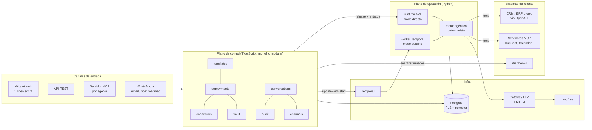

# Arquitectura de Saas-Agentes

> Plataforma multi-tenant para **crear una vez** plantillas de agentes de IA y **desplegarlas en minutos** para
> cada cliente, integradas donde el cliente ya trabaja: su web, su CRM (propio o de mercado), su ERP, WhatsApp,
> el Claude/ChatGPT de su equipo…
>
> Investigación y decisiones a fecha 2026-09-24.

## 1. Principio rector

**Construir la plataforma puede ser lento. Desplegar a un cliente tiene que ser rapidísimo.**

Todas las decisiones se optimizan para el *time-to-deploy* de un cliente nuevo:

| Palanca | Cómo se consigue |
|---|---|
| Nada de código por cliente | Un cliente es un YAML de ~40 líneas (o un formulario): parámetros + enlaces a sus sistemas |
| Integración con *cualquier* sistema | Capacidades abstractas + importador OpenAPI + MCP. El CRM propio del cliente se conecta con su spec |
| Muchas "puertas" de entrada | El mismo agente es a la vez API REST, widget web de una línea, servidor MCP (y WhatsApp/email/voz) |
| Confianza para desplegar rápido | Releases inmutables con evals, aprobaciones humanas por política, auditoría, rollback en un clic |
| Mismo artefacto en todas partes | SaaS compartido, tenant dedicado u on-prem con el mismo docker-compose / Helm chart |

Medido en el E2E del repo (`scripts/e2e.sh`): `agentes deploy cliente.yaml` publica el agente de un cliente nuevo
con su CRM importado, conocimiento indexado, 6 tools, widget, endpoint MCP y API keys en **~0,2 s** de plataforma.
Lo que queda es trabajo humano (rellenar parámetros y conseguir la spec/credenciales del cliente): minutos, no semanas.

## 2. Vista general



- **Plano de control** (`apps/api`): dueño de los datos de negocio. Tenants, catálogo de plantillas, despliegues,
  releases, conversaciones, aprobaciones, auditoría, bóveda de credenciales, canales.
- **Plano de ejecución** (`services/runtime`): cómputo puro. Recibe *release + estado + entrada* y devuelve
  *nuevo estado + resultado*. No decide nada de negocio que no esté en el release.
- **Contrato entre ambos**: el **release** (`packages/agent-spec/schema/release.schema.json`), validado en los dos
  lados y con un test de contrato en CI.

## 3. Parametrización: las 4 capas (núcleo del producto)

| Capa | Quién la escribe | Qué contiene | Dónde |
|---|---|---|---|
| **1. Plantilla** | Nosotros, una vez | Parámetros (JSON Schema → formulario), instrucciones con `{{variables}}`, procedimientos (SOPs), **capacidades abstractas** con tier de riesgo, autonomía por defecto y **máxima**, guardrails, canales, evals golden | `templates/<id>/template.yaml` |
| **2. Conector** | Nosotros (catálogo) o **generado** desde el OpenAPI del cliente | Cómo se hace una capacidad en un sistema concreto (operación HTTP o tool MCP) y qué credencial usa | importado en `connectors` |
| **3. Despliegue** | El cliente / onboarding, **sin código** | Valores de parámetros, **binding capacidad → conector**, referencias a credenciales, conocimiento, canales, autonomía y overrides **dentro de los límites** | `cliente.yaml` o formulario |
| **4. Release** | La plataforma | Snapshot **inmutable** y resuelto de las 3 capas, identificado por hash. Lo único que ejecuta el runtime | tabla `releases` |

### La clave para "cualquier CRM"

La plantilla nunca dice "HubSpot". Dice `crm.buscar_cliente` o `tickets.crear`. El despliegue de cada cliente enlaza
esa capacidad con **su** sistema:

```yaml
connectors:
  - id: crm-lopez
    type: openapi
    spec: ./crm-lopez-openapi.yaml        # su CRM propio: basta con su OpenAPI
    auth: { type: api_key, header: X-API-Key, credential: crm-lopez-key }
bindings:
  crm.buscar_cliente: { connector: crm-lopez, operation: buscarClientes }
  pedidos.consultar:  { connector: crm-lopez, operation: "GET /pedidos/{numero}" }
```

Si falta una capacidad obligatoria, o la operación no existe, el despliegue **no se publica** y el error dice
exactamente qué falta (se acumulan todos los problemas en un único error).

### Resolución (`packages/agent-spec/src/resolve.ts`, función pura)

1. Plantilla y versión compatibles (`atencion-cliente@^1.0`, semver).
2. Parámetros validados contra el JSON Schema de la plantilla, con defaults aplicados.
3. Autonomía ≤ máximo de la plantilla.
4. Cada capacidad → tool: builtin, HTTP (desde OpenAPI) o MCP. Obligatorias sin binding = error.
5. Overrides del cliente **solo pueden endurecer** (capacidades `locked`, guardrails, entrada no confiable).
6. Aprobación efectiva por tool = f(tier, autonomía, overrides) → se congela en el release.
7. Credenciales → **referencias** `vault://tenant/nombre` (el release nunca contiene secretos).
8. Render de `{{variables}}` (motor sin lógica: las plantillas son datos, no programas).
9. Hash canónico → `rel_<16 hex>`. Mismo input = mismo release (despliegues idempotentes).

### Versionado de plantillas

Cada cliente queda fijado a un rango (`@^1.0`). Una plantilla nueva (`1.3.0`) no cambia a nadie hasta que se
redespliega. Flujo de migración recomendado: `agentes deploy --dry-run` con la nueva versión → `agentes eval` →
publicar. Rollback = reactivar un release anterior (`POST /v1/agents/:id/activate`).

## 4. Autonomía: una política, no código distinto

Del asistente que solo sugiere al agente totalmente autónomo es **el mismo runtime** con otra configuración.
Niveles según *Levels of Autonomy for AI Agents* (Feng, McDonald & Zhang, [arXiv 2506.12469](https://arxiv.org/abs/2506.12469)),
definidos por el papel del humano, cruzados con el **tier** de cada capacidad:

| Nivel | Rol humano | read | write (reversible) | irreversible | financial |
|---|---|---|---|---|---|
| L1 | Operador | aprobar | aprobar | aprobar | aprobar |
| L2 | Colaborador | auto | aprobar | aprobar | aprobar |
| L3 | Consultor | auto | auto | aprobar | aprobar |
| L4 | Aprobador | auto | auto | auto | aprobar |
| L5 | Observador | auto | auto | auto | auto* |

\* Salvo capacidades con `approval: always` (p.ej. `pedidos.reembolsar` en la plantilla de atención al cliente),
que **siempre** requieren aprobación y el cliente no puede relajar (`locked: true`).

El runtime re-verifica la política (defensa en profundidad): aunque un release llegara manipulado, nada
financiero/irreversible se ejecuta sin aprobación si la autonomía no lo permite. Principio *least agency* de
OWASP Top 10 for Agentic Applications 2026.

## 5. Plano de ejecución

### Motor determinista con efectos inyectables

`services/runtime/agentes_runtime/engine.py`. Toda E/S (LLM, tools) pasa por una interfaz `Effects`. Resultado:
el **mismo código** corre en dos modos:

| Modo | Uso | Estado de la conversación | Garantías |
|---|---|---|---|
| `direct` | desarrollo, clientes pequeños | en Postgres (plano de control) | reintentos simples |
| `temporal` | producción | dentro de un workflow `conv:<id>` | cada llamada LLM/tool es una actividad durable; si un worker muere, se reanuda sin repetir escrituras; esperas de días sin coste |

Máquina de estados por conversación: `idle → awaiting_approval | handoff → idle`.

- **Hora del turno**: cada turno lleva `now` (la API en modo directo, `workflow.now()` en Temporal, que es
  determinista). El motor la añade al mensaje del cliente en la zona horaria del negocio (parámetro convencional
  `zona_horaria`), fuera del system prompt para no invalidar el prompt caching.

- **Aprobaciones**: la tool queda pendiente, se persiste, un humano decide (consola/API) y el motor reanuda
  exactamente donde estaba. En Temporal, una aprobación sin revisar **expira sola a las 24 h** (timer durable) y se
  notifica al plano de control.
- **Handoff**: `humano.escalar` pausa al agente; los mensajes del cliente se guardan pero el agente no responde
  hasta que una persona devuelve la conversación (`resume_bot`).
- **Idempotencia**: toda escritura HTTP lleva `Idempotency-Key = hash(conversación, tool_use_id)`, estable entre
  reintentos de Temporal.
- **Guardrails**: límite de pasos por turno, validación de argumentos contra el schema de la tool, tools
  inexistentes rechazadas, reglas de plataforma no sobreescribibles en el system prompt.

### LLM multi-proveedor vía gateway

El runtime usa el **SDK oficial de Anthropic** contra **LiteLLM**, que expone la API Messages para cualquier
proveedor. Las plantillas solo conocen **alias** (`agente-default`, `agente-rapido`); qué modelo hay detrás se
decide en `infra/litellm.yaml` (por defecto `claude-opus-5`, con fallback a otro proveedor). Virtual key por
tenant → presupuesto y rate limit por cliente. El system prompt se marca para *prompt caching* (estable por release).

Para desarrollo/CI existe `LLM_PROVIDER=fake`: un "modelo" determinista por reglas que permite probar el
cableado completo (tools, políticas, estados, evals) sin coste.

### Tools

| Tipo | Ejemplo | Implementación |
|---|---|---|
| builtin | `conocimiento.buscar`, `humano.escalar` | la plataforma |
| HTTP | cualquier operación de un OpenAPI importado | path/query/header/body reconstruidos desde el binding |
| MCP | tools de un servidor MCP remoto | descubiertas con `tools/list` al desplegar (plano de control); ejecutadas con un cliente Streamable HTTP sin estado (spec 2026-07-28) con fallback a sesión (runtime) |

Los secretos se canjean **solo en el momento de ejecutar** (`/internal/credentials/resolve`) y se usan para la
cabecera HTTP: nunca entran en el contexto del modelo, ni en el release, ni en la auditoría.

### Conocimiento (RAG)

pgvector con RLS por tenant, troceado por secciones markdown, búsqueda por coseno con umbral mínimo. Embeddings
vía gateway en producción; embeddings léxicos deterministas en desarrollo. Pasar a una base vectorial dedicada solo
cuando latencia o tamaño lo exijan (el caveat conocido de pgvector es el post-filtrado en tenants pequeños dentro
de tablas grandes; la solución es particionar por tenant o mover tenants grandes a su propio almacén).

### Canales asíncronos (WhatsApp)

La respuesta no vuelve en la petición: todo texto para el cliente sale por un único puerto (`ChannelSender`),
incluidas las respuestas diferidas (aprobación resuelta, respuesta humana, expiración en Temporal). Entrada por
webhook por agente con firma HMAC, 200 inmediato, deduplicación por `wamid` y una conversación por número.
Ventana de 24 h controlada con `last_customer_at`: fuera de ella, plantilla aprobada o no se envía. Ver
[ADR 0008](adr/0008-canales-asincronos.md) y la sección *Activar WhatsApp* de [nuevo-cliente](nuevo-cliente.md).

## 6. Multi-tenancy y seguridad

- **RLS forzada** en todas las tablas de tenant (`ENABLE` + `FORCE ROW LEVEL SECURITY`), tenant fijado con
  `SET LOCAL app.tenant_id` por transacción. La app usa un rol **no propietario y sin BYPASSRLS**; un pool admin
  separado se usa solo en operaciones de plataforma (alta de tenant, resolver una API key). Test automatizado:
  otro tenant no ve nada, y sin tenant fijado la app no ve ninguna fila.
- **Bóveda**: AES-256-GCM con clave maestra fuera de la BD y AAD = tenant+nombre. Interfaz pensada para
  sustituirse por HashiCorp Vault / KMS / Nango sin tocar el resto (fuera del módulo solo circulan referencias).
- **Conexiones OAuth**: el cliente autoriza con su cuenta mediante un enlace de un solo uso (state aleatorio +
  PKCE S256). Tokens cifrados en la bóveda; la renovación ocurre solo en el plano de control, con bloqueo de fila
  para no renovar dos veces; `invalid_grant` marca la conexión para reconectar. Ver [ADR 0009](adr/0009-oauth-por-tenant.md).
- **API keys** por tipo: `admin` (tenant), `agent` (servidor a servidor / MCP), `widget` (pública, solo chat con
  su agente). Solo se guarda el hash; se muestran una vez.
- **Entrada no confiable**: mensajes de clientes y resultados de tools son datos, no instrucciones (reglas de
  plataforma en el prompt + separación estructural: las acciones sensibles pasan por política, no por lo que diga
  el texto). Para plantillas de alto riesgo (email entrante, documentos de terceros) el siguiente paso es el patrón
  *plan-then-execute / dual-LLM* ([Beurer-Kellner et al., arXiv 2506.08837](https://arxiv.org/abs/2506.08837)).
- **Auditoría append-only**: trigger que impide UPDATE/DELETE y permisos revocados al rol de la app. Cada evento
  lleva actor, release y datos (qué tool, con qué argumentos, quién aprobó).
- **Endpoints `/internal/*`**: solo red interna + token; el Ingress del chart no los publica.

## 7. Por qué monolito modular (y no microservicios desde el día 1)

Ver [ADR 0001](adr/0001-monolito-modular.md). Resumen:

1. La velocidad de despliegue **por cliente** no depende de microservicios sino de que todo sea configuración:
   un cliente nuevo son filas y un release, no un servicio nuevo.
2. Al inicio el modelo (plantillas/capacidades/releases) cambia mucho; cada frontera de microservicio sería un
   contrato versionado más que mantener.
3. Publicar un release (validar → congelar → auditar → activar) es **una transacción**; distribuido serían sagas.
4. El modo **on-prem** exige instalarse en la infraestructura del cliente: 5-6 contenedores, no 20.
5. Lo que escala distinto **ya está separado**: runtime (Python, escala por conversaciones), worker durable,
   gateway LLM, conectores MCP, y el canal de webhooks.
6. Camino de salida garantizado: `dependency-cruiser` en CI impide que un módulo use internals de otro (solo su
   `index.ts`), prohíbe ciclos y que `shared/` dependa de módulos. Cualquier módulo se extrae sin reescribir.

## 8. Observabilidad y calidad

- **Evals golden por plantilla** (`templates/<id>/evals/golden.yaml`): en CI con el modelo fake (cableado) y
  contra el modelo real antes de publicar/migrar (`agentes eval`).
- **Trazas**: LiteLLM → Langfuse (self-hosted) con `metadata.user_id = tenant` para coste por cliente. Siguiente
  paso: spans OpenTelemetry GenAI (`invoke_agent` → `chat` / `execute_tool`) desde el runtime con `tenant_id`,
  `template_id`, `release_id` (las convenciones `gen_ai.*` siguen en estado *Development* a 2026).
- **Tokens por conversación** acumulados en `conversations` y eventos `llm.call` en auditoría.

## 9. Estado de la investigación (2025-2026) que sustenta las decisiones

**Frameworks.** Separar dos capas: *bucle agéntico* y *ejecución durable*. Opciones maduras: Claude Agent SDK /
Tool Runner / Managed Agents (beta, con vaults y sesiones de horas), OpenAI Agents SDK (ojo: **Agent Builder cierra
el 2026-11-30**), LangGraph 1.x (checkpointing + `interrupt()`), Google ADK 2.x (Agent Config YAML), Microsoft
Agent Framework 1.0 (declarative agents/workflows YAML), Pydantic AI (durable con Temporal/DBOS/Restate), Mastra
(TS). Motores durables: Temporal (el más maduro, SDKs TS y Python — por eso encaja con nuestro stack híbrido),
Restate, DBOS (solo Postgres), Inngest. **Decisión**: motor propio mínimo (≈250 líneas, determinista, testeable)
sobre Temporal, para controlar políticas, aprobaciones y el contrato de release sin atarnos a un framework.

**Especificaciones declarativas.** ADK Agent Config, Microsoft declarative agents, Oracle Open Agent Spec, Letta
`.af`, CrewAI YAML, Agent Skills (SKILL.md). Patrón común: plantilla inmutable versionada con `{{variables}}` +
instancia por cliente con valores, credenciales por referencia, conocimiento y canales. Nuestro formato propio
(JSON Schema) sigue ese patrón y es neutral de proveedor.

**Cómo lo hacen las plataformas comerciales.** Salesforce Agentforce (Topics → *Subagents*, Agent Script mezcla
lenguaje natural con lógica determinista), Decagon (AOPs: SOPs en lenguaje natural que "compilan"), Intercom Fin
(Procedures + data connectors + Guidance), Sierra (Agent SDK, journeys, multicanal), Copilot Studio (topics,
actions, event triggers). Abstracciones comunes que adoptamos: instrucciones, **procedimientos por intención**,
acciones/tools, conocimiento, guardrails, canales, triggers, evals y releases versionados. Dify/n8n/Flowise no
sirven como núcleo multi-tenant (licencia/diseño single-tenant).

**Estándares.** MCP (Linux Foundation / AAIF) — spec **2026-07-28**: núcleo sin estado, enrutado por cabeceras
`Mcp-Method`/`Mcp-Name`, extensión Tasks para operaciones largas, OAuth 2.1 endurecido. A2A v1.0 (abril 2026) para
exponer agentes a agentes de otras organizaciones. Agent Skills como formato portable de playbooks.

**Canales.** WhatsApp Cloud API: ventana de 24 h (fuera solo plantillas aprobadas) y **cambio de precios el
2026-10-01** (varias fuentes indican que las respuestas dentro de la ventana pasan a facturarse — verificar en la
página oficial de Meta antes de fijar precios). Voz: LiveKit Agents / Pipecat con pipeline en cascada
(STT→LLM→TTS, 0,6-1,2 s en buenas condiciones) por trazabilidad y auditoría.

**Casos financieros (conciliaciones).** Motor determinista primero (exacto, difuso, splits por importe/referencia/
ventana de fechas); el LLM solo clasifica excepciones con confianza y propone; humano aprueba; todo auditado con
versión de regla/modelo.

## 10. Hoja de ruta

| Fase | Contenido |
|---|---|
| **1 ✔** | Plantilla atención al cliente · 4 capas · OpenAPI→tools · MCP entrada · widget · aprobaciones · handoff · RLS · bóveda · Temporal · CLI · evals · Helm |
| **2 (en curso)** | ✔ Plantilla **agendar citas** (sin cambios en el motor) · ✔ conectores **MCP de salida** con descubrimiento `tools/list` al desplegar · ✔ hora del turno en la zona del cliente · ✔ **canal WhatsApp** (webhook firmado, deduplicación, ventana de 24 h, respuestas diferidas; [ADR 0008](adr/0008-canales-asincronos.md)) · ✔ **conexiones OAuth por cliente** (enlace de un clic, PKCE, renovación automática con bloqueo, revocación; [ADR 0009](adr/0009-oauth-por-tenant.md)) · pendiente: email, streaming SSE |
| 3 | Plantillas **inventario** y **CRM operado por agentes** · triggers por evento/cron (el agente actúa sin que nadie escriba) · virtual keys de LiteLLM por tenant automáticas · spans OTel GenAI |
| 4 | Plantilla **conciliaciones**: motor determinista + LLM para excepciones + aprobaciones por lotes |
| 5 | **Agentes autónomos** (L4-L5) con objetivos, presupuestos y memoria · multi-agente (un agente delega en otro vía A2A/MCP) · voz (LiveKit) · marketplace de plantillas · sandbox de código (E2B/Firecracker) para tools generadas |

## 11. Mapa del repositorio

```
packages/agent-spec/     Formato de las 4 capas (JSON Schema), resolución, importador OpenAPI, política
templates/<id>/          Plantillas (capa 1): template.yaml + procedures/*.md + evals/golden.yaml
apps/api/                Plano de control (Fastify, monolito modular, módulos en src/modules/*)
apps/cli/                `agentes deploy | eval | chat | templates`
services/runtime/        Motor, políticas, tools, RAG, API interna, workflow y worker de Temporal
db/migrations/           Esquema multi-tenant con RLS
examples/                CRM mock con OpenAPI y cliente de ejemplo (Ferretería López)
infra/                   docker-compose, LiteLLM
deploy/helm/agentes/     Chart único para SaaS / dedicado / on-prem
scripts/                 e2e.sh (despliegue rápido de punta a punta), temporal-dev.py
docs/                    Esta documentación y ADRs
```
